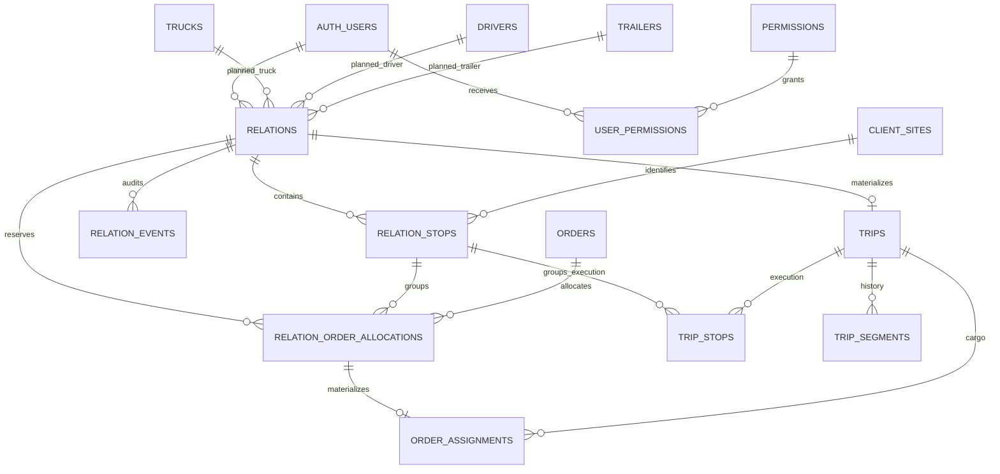

# K3 Logistics V4 — Phase 2 Architecture

Status: **FINAL / IMPLEMENTATION-READY PLAN**
Phase: **2 — Implementation-ready architecture and migration plan**
Date: **2026-08-18**
Repository: `aleksandurbojilov09-lgtm/cm-logistics-v3`
Phase 2 starting `main`: `4fb51dd0fb207e1642325ad60a83ca3bfd51e103`
Phase 2 starting `dev`: `bec697b966eb1a3877003b93c64caadb07a5ace7`

> This document is architecture and migration planning only. It does not create Relation tables, migrations, RPCs, permissions, staging resources, Edge Functions, or production changes.

---

## 1. Executive decision

V4 adds a **Relation planning layer before the existing V3 Trip execution boundary**.

The ownership boundary is final:

- before Trip start, `relations` owns planning state, dates, ordered physical Stops, Order allocations, intended Fleet composition, revision and audit;
- at Trip start, one protected transaction materializes the Relation into the existing V3 operational model;
- after Trip start, `trips`, `trip_segments`, `trip_stops`, `order_assignments` and `vehicle_assignments` remain the operational and historical source of truth;
- one started Relation creates exactly one Trip;
- V3 legacy flows remain available during staged rollout and are not rewritten in Phase 2.

Canonical planning quantity is **integer kilograms**. One Relation is one Truck and may not exceed **24,000 kg**.

---

## 2. Evidence and inspected sources

### 2.1 GitHub baseline

Verified at the start of Phase 2:

| Branch | SHA | Result |
|---|---|---|
| `main` | `4fb51dd0fb207e1642325ad60a83ca3bfd51e103` | exact expected production baseline |
| `dev` | `bec697b966eb1a3877003b93c64caadb07a5ace7` | exact Phase 1 completion baseline |

The Phase 1 completion commit changed only:

- `docs/V4-PHASE-1-AUDIT.md`
- `docs/V4-PHASE-2-INPUTS.md`

### 2.2 Phase 1 documents read completely

- `docs/V4-PHASE-1-AUDIT.md`
- `docs/V4-PHASE-2-INPUTS.md`

### 2.3 Repository migrations inspected

All 13 repository migrations were inspected and live migration history was independently verified to contain the same 13 versions, in the same order:

1. `20260815162400_create_fixed_locations.sql`
2. `20260816121500_orders_assign_location_load.sql`
3. `20260816123700_orders_assign_location_load_lock_order.sql`
4. `20260816135200_trips_admin_driver_archive.sql`
5. `20260816143500_trips_get_driver_archive.sql`
6. `20260816154500_trips_admin_bioexis_report.sql`
7. `20260817042000_dispatcher_operations_authorization.sql`
8. `20260817080500_client_single_active_site.sql`
9. `20260817102500_trips_official_bioexis_weight.sql`
10. `20260817104500_official_weight_kg_display_fix.sql`
11. `20260817144000_password_reset_requests.sql`
12. `20260817162500_password_reset_admin_workflow.sql`
13. `20260818070000_password_reset_active_client_memberships.sql`

The migration history is still **INCOMPLETE as a rebuild baseline** because the V3 core schema predates the first repository migration.

### 2.4 Workflows inspected

- `.github/workflows/build.yml`
- `.github/workflows/supabase-db.yml`
- `.github/workflows/deploy-supabase-functions.yml`
- `.github/workflows/cloudflare.yml`
- `.github/workflows/pages.yml`

Important verified deployment boundary:

- docs-only push to `dev` triggers the general build;
- DB workflow is path-scoped to `supabase/migrations/**`, `supabase/config.toml` and its workflow file;
- `dev` DB flow is dry-run only;
- real DB, Edge Function, Cloudflare and Pages deployment is restricted to `main`.

### 2.5 TypeScript modules inspected

- `src/pages/admin/admin-page.ts`
- `src/pages/dispatcher/dispatcher-page.ts`
- `src/pages/admin/sections/orders-location-grouping.ts`
- `src/pages/admin/sections/orders-map.ts`
- `src/shared/lib/leaflet-loader.ts`
- `src/features/orders/admin-orders-service.ts`
- `src/features/fleet/fleet-service.ts`
- `src/features/trips/driver-trip-service.ts`

Verified reusable frontend facts:

- Dispatcher uses the same Operations/Admin portal implementation as Admin.
- Physical location identity is already `company_id + site_id`.
- Existing location grouping is pure logic and orders are oldest-first by `created_at`, then `id`.
- Shared Leaflet loader exists and should be reused.
- Current Orders map is tightly coupled to legacy Truck assignment behavior and must not be copied wholesale.

### 2.6 Live Supabase catalog inspected read-only

Production project: `cm-logistics-v3` / `bqrwcgortfmjjdywqzqu`.

Inspected live:

- core table columns, defaults, constraints and indexes;
- `orders`, `order_assignments`, `trips`, `trip_stops`, `trip_segments`;
- `trucks`, `drivers`, `trailers`, `vehicle_assignments`, `driver_home_trucks`;
- `roles`, `permissions`, `user_roles`, `role_permissions`, `profiles`;
- RLS policies;
- function definitions and EXECUTE grants;
- relevant triggers;
- migration history;
- installed extensions;
- security advisor output.

No `relation`, `route` or `planning` table/function names currently conflict with the names selected below.

### 2.7 Important live V3 functions/triggers inspected

- `cm_private.has_permission(text)`
- `public.has_my_permission(text)`
- `public.orders_assign_load(...)`
- `public.orders_assign_location_load(...)`
- `public.orders_cancel_assignment(...)`
- `public.fleet_set_permanent_composition(...)`
- `public.fleet_release_truck(...)`
- `public.trips_start_driver(bigint)`
- `public.trips_mark_stop_loaded(uuid)` and unchecked implementation
- `public.trips_finish_driver(bigint)`
- `public.trips_finish_driver(bigint,bigint)`
- unchecked Trip completion implementation
- Driver handoff and Truck-change RPCs
- order allocation/capacity/loading-ramp triggers
- temporary Fleet restoration trigger on Trip completion

Key compatibility fact: current V3 capacity/assignment flows intentionally serialize **Truck before Order**. V4 must preserve this relative direction whenever it intersects legacy operational rows; a new Orders-before-Truck lock order would create avoidable deadlock risk during coexistence.

---

## 3. Final business decisions

### 3.1 Capacity

- One Relation always represents one Truck.
- Maximum planned cargo: `24000` integer kg.
- DB/RPC canonical unit: kg.
- UI may display tons, but conversion is presentation only.

### 3.2 Planning dates

- `planned_load_date date NOT NULL`.
- `expected_return_date date NOT NULL`.
- `expected_return_date > planned_load_date`.
- The period is inclusive for Fleet conflict purposes.
- This guarantees at least two different calendar dates.
- It is **not** a 48-hour duration requirement.

### 3.3 Fleet future scheduling

The same Truck, Driver or Trailer may be assigned to several future Relations only when their inclusive planned date ranges do not overlap.

DB-level non-overlap applies to Relation states:

- `assigned`
- `in_progress`

At runtime, an actual active Trip for a selected Truck, Driver or Trailer blocks the next Relation start regardless of planned dates.

### 3.4 Reservation lifecycle

| Relation state | Reservation behavior |
|---|---|
| `draft` | no hard reservation |
| `sent` | reservation active |
| `assigned` | reservation active |
| `in_progress` | planning reservation no longer counted; operational `order_assignments` own quantity |
| `completed` | operational history owns quantity |
| `cancelled` | no reservation |

### 3.5 Physical stop grouping

Canonical physical identity:

`company_id + site_id`

One Relation Stop represents one physical visit. It may contain several underlying Order allocations. At execution:

- Driver sees one grouped visit;
- one Driver action completes the whole physical group atomically;
- every underlying Order still has its own `order_assignment`;
- every `order_assignment` still has exactly one `trip_stop`.

### 3.6 Ownership boundary

| Time | Source of truth |
|---|---|
| Before Trip start | Relation planning layer |
| After Trip start | existing V3 Trip / segment / stop / assignment / Fleet history |

A Relation is not a replacement for Trip history.

---

## 4. Final state machine

### 4.1 Status values

`draft`, `sent`, `assigned`, `in_progress`, `completed`, `cancelled`

### 4.2 Transition matrix

| From | To | Actor | Permission / rule | Atomic effect |
|---|---|---|---|---|
| `draft` | `draft` | Planner/Admin | `relations.plan` | save dates/stops/allocations; no reservation; revision +1 |
| `draft` | `sent` | Planner/Admin | `relations.plan` | validate and reserve Order quantities; revision +1 |
| `draft` | `cancelled` | Planner/Admin | `relations.plan` | soft cancel; revision +1 |
| `sent` | `draft` | Planner/Admin | `relations.plan`; no Fleet, no Trip | release reservations; revision +1 |
| `sent` | `assigned` | Fleet/Admin | `relations.dispatch` | validate dates/resources/conflicts; persist intended Fleet; revision +1 |
| `sent` | `sent` | Fleet/Admin | `relations.dispatch` | reorder/move/swap; reservations remain; revision +1 |
| `assigned` | `assigned` | Fleet/Admin | `relations.dispatch`; no Trip | reorder/move/swap/date/fleet replacement; revalidate; revision +1 |
| `assigned` | `sent` | Fleet/Admin | `relations.dispatch`; no Trip | remove intended Fleet; reservation remains; revision +1 |
| `assigned` | `in_progress` | assigned Driver | protected start RPC | materialize exactly one Trip atomically; revision +1 |
| `in_progress` | `completed` | protected Trip completion | existing Driver completion flow + V4 guard | complete Trip and synchronize Relation; revision +1 |

Forbidden:

- Planner mutation of an `assigned` Relation.
- Planner withdrawal of an `assigned` Relation.
- Any planning mutation after a linked Trip exists.
- `in_progress -> planning`.
- reopening `completed` or `cancelled`.
- hard deletion after the Relation has business content/history.

### 4.3 Revision rule

All Planner/Fleet mutation RPCs receive `p_expected_revision bigint`.

Algorithm:

1. lock Relation row;
2. compare `revision = p_expected_revision`;
3. if mismatch, raise SQLSTATE `40001` with stable message `RELATION_REVISION_CONFLICT`;
4. validate/mutate;
5. increment revision exactly once per affected Relation;
6. insert immutable event with the new revision;
7. return the new revision.

Cross-Relation move/swap accepts both expected revisions and locks both Relation headers in UUID order before comparison. If either is stale, the entire operation rolls back.

Read RPCs always return `revision`.

---

## 5. Final data model

### 5.1 `public.relations`

| Column | Type | Null | Default | Rule |
|---|---|---:|---|---|
| `id` | `uuid` | no | `gen_random_uuid()` | PK |
| `relation_number` | `bigint` | no | next sequence value | unique business number |
| `status` | `text` | no | `'draft'` | six allowed statuses |
| `planned_load_date` | `date` | no | none | planning calendar date |
| `expected_return_date` | `date` | no | none | must be later than load date |
| `revision` | `bigint` | no | `1` | `revision >= 1` |
| `planned_truck_id` | `uuid` | yes | null | FK `trucks(id)` RESTRICT |
| `planned_driver_id` | `uuid` | yes | null | FK `drivers(id)` RESTRICT |
| `planned_trailer_id` | `uuid` | yes | null | FK `trailers(id)` RESTRICT |
| `created_by` | `uuid` | no | none | FK `auth.users(id)` RESTRICT; RPC writes `auth.uid()` |
| `sent_at` | `timestamptz` | yes | null | lifecycle timestamp |
| `assigned_at` | `timestamptz` | yes | null | lifecycle timestamp |
| `cancelled_at` | `timestamptz` | yes | null | lifecycle timestamp |
| `created_at` | `timestamptz` | no | `now()` | audit time |
| `updated_at` | `timestamptz` | no | `now()` | server maintained |

Sequence: `public.relations_relation_number_seq`.

Checks:

- `expected_return_date > planned_load_date`;
- `revision >= 1`;
- status in final set;
- `sent`: `sent_at IS NOT NULL`, Fleet fields null;
- `assigned`/`in_progress`/`completed`: `sent_at`, `assigned_at` and all three planned Fleet IDs non-null;
- `cancelled`: `cancelled_at IS NOT NULL` and no planned Fleet;
- `draft`: no planned Fleet; `sent_at`, `assigned_at`, `cancelled_at` null.

The original send time is preserved in immutable `relation_events`; returning `sent -> draft` resets current-state `sent_at` because it no longer represents current lifecycle state.

Do **not** store `total_kg`; calculate from allocations.

### 5.2 `public.relation_stops`

| Column | Type | Null | Default | Rule |
|---|---|---:|---|---|
| `id` | `uuid` | no | `gen_random_uuid()` | PK |
| `relation_id` | `uuid` | no | none | FK `relations(id)` RESTRICT |
| `stop_number` | `integer` | no | none | > 0; contiguous enforced by mutation RPC |
| `company_id` | `uuid` | no | none | physical identity part 1 |
| `site_id` | `uuid` | no | none | physical identity part 2 |
| `created_at` | `timestamptz` | no | `now()` | |
| `updated_at` | `timestamptz` | no | `now()` | |

Constraints:

- `UNIQUE(relation_id, stop_number)`;
- `UNIQUE(relation_id, company_id, site_id)`;
- `UNIQUE(relation_id, id)` for composite child FK;
- composite FK `(company_id, site_id) -> client_sites(company_id, id)` RESTRICT.

No address/name/coordinates are duplicated here. Planning display data comes from trusted Order snapshots/site read models; immutable execution snapshots are created later in `trip_stops`.

### 5.3 `public.relation_order_allocations`

| Column | Type | Null | Default | Rule |
|---|---|---:|---|---|
| `id` | `uuid` | no | `gen_random_uuid()` | PK |
| `relation_id` | `uuid` | no | none | FK `relations(id)` RESTRICT |
| `relation_stop_id` | `uuid` | no | none | part of same-Relation composite FK |
| `order_id` | `uuid` | no | none | FK `orders(id)` RESTRICT |
| `allocated_kg` | `bigint` | no | none | > 0 |
| `created_at` | `timestamptz` | no | `now()` | |
| `updated_at` | `timestamptz` | no | `now()` | |

Constraints:

- `CHECK(allocated_kg > 0)`;
- `UNIQUE(relation_id, order_id)`;
- composite FK `(relation_id, relation_stop_id) -> relation_stops(relation_id,id)` RESTRICT, `DEFERRABLE INITIALLY IMMEDIATE`. Move/swap RPCs explicitly defer this constraint while updating the parent Stop and all child allocations atomically.

A DB helper/trigger validates that the referenced Order has the same `company_id` and `site_id` as its Relation Stop. Frontend-supplied physical identity is never trusted.

An Order may be split across different Relations when quantity allows it.

### 5.4 `public.relation_events`

| Column | Type | Null | Default | Rule |
|---|---|---:|---|---|
| `id` | `uuid` | no | `gen_random_uuid()` | PK |
| `relation_id` | `uuid` | no | none | FK `relations(id)` RESTRICT |
| `event_type` | `text` | no | none | allowed event inventory |
| `actor_user_id` | `uuid` | no | none | FK `auth.users(id)` RESTRICT |
| `from_status` | `text` | yes | null | valid status when present |
| `to_status` | `text` | yes | null | valid status when present |
| `relation_revision` | `bigint` | no | none | > 0 |
| `payload` | `jsonb` | no | `'{}'::jsonb` | object only |
| `created_at` | `timestamptz` | no | `now()` | immutable event time |

No UPDATE or DELETE app path. RPC inserts only.

Event inventory:

- `draft_created`
- `draft_saved`
- `sent`
- `withdrawn_to_draft`
- `draft_cancelled`
- `stops_reordered`
- `stop_moved_out`
- `stop_moved_in`
- `stops_swapped`
- `fleet_assigned`
- `fleet_replaced`
- `dates_changed`
- `fleet_unassigned`
- `trip_started`
- `physical_stop_loaded`
- `trip_completed`

`physical_stop_loaded` does not increment Relation revision; it records the current revision because it is operational progress, not a planning version change.

### 5.5 `public.user_permissions`

This is the user-scoped extension of the existing RBAC model, not a second role/auth system.

| Column | Type | Null | Default | Rule |
|---|---|---:|---|---|
| `user_id` | `uuid` | no | none | FK `auth.users(id)` CASCADE |
| `permission_id` | `uuid` | no | none | FK `permissions(id)` RESTRICT |
| `granted_by` | `uuid` | no | none | FK `auth.users(id)` RESTRICT |
| `created_at` | `timestamptz` | no | `now()` | |

PK: `(user_id, permission_id)`.

New permission codes:

- `relations.plan`
- `relations.dispatch`

`cm_private.has_permission(text)` is extended later to preserve current semantics:

1. user must be active;
2. primary Admin remains wildcard;
3. user-scoped `user_permissions` grants are checked;
4. existing role-based `role_permissions` remain valid for legacy permissions.

Do not grant `relations.plan` or `relations.dispatch` to all Dispatchers through `role_permissions` by default.

### 5.6 Operational integration columns

#### `public.trips`

Add:

`relation_id uuid NULL UNIQUE REFERENCES public.relations(id) ON DELETE RESTRICT`

This is the **single stored Relation-to-Trip link**. Do not add a duplicate `relations.trip_id`.

#### `public.trip_stops`

Add:

`relation_stop_id uuid NULL REFERENCES public.relation_stops(id) ON DELETE RESTRICT`

Legacy Trip Stops remain null. V4 Driver grouping uses this identity.

#### `public.order_assignments`

Add:

`relation_allocation_id uuid NULL UNIQUE REFERENCES public.relation_order_allocations(id) ON DELETE RESTRICT`

This gives exact one-time planning-to-operational lineage and prevents accidental duplicate materialization of one allocation.

### 5.7 Foreign-key diagram



---

## 6. Index and constraint inventory

### 6.1 Core indexes

`relations`:

- PK `id`;
- UNIQUE `relation_number`;
- index `(status, planned_load_date, relation_number)`;
- index `(planned_load_date, status)`;
- index `(planned_truck_id, planned_load_date)` where planned Truck non-null;
- index `(planned_driver_id, planned_load_date)` where planned Driver non-null;
- index `(planned_trailer_id, planned_load_date)` where planned Trailer non-null.

`relation_stops`:

- PK `id`;
- UNIQUE `(relation_id, stop_number)`;
- UNIQUE `(relation_id, company_id, site_id)`;
- UNIQUE `(relation_id, id)`;
- index `(company_id, site_id)`.

`relation_order_allocations`:

- PK `id`;
- UNIQUE `(relation_id, order_id)`;
- index `(order_id)`;
- index `(relation_stop_id)`.

`relation_events`:

- PK `id`;
- index `(relation_id, created_at, id)`;
- index `(actor_user_id, created_at)`.

`user_permissions`:

- PK `(user_id, permission_id)`;
- index `(permission_id, user_id)`.

Integration:

- UNIQUE index/constraint `trips(relation_id)` where non-null or a normal UNIQUE nullable constraint;
- index `trip_stops(relation_stop_id)` where non-null;
- UNIQUE `order_assignments(relation_allocation_id)` where non-null.

### 6.2 Fleet non-overlap protection

Future migration enables `btree_gist` if absent. Live production currently does **not** have it installed.

Create three partial GiST exclusion constraints on `relations`, active only for `status IN ('assigned','in_progress')`:

- same `planned_truck_id` may not overlap `daterange(planned_load_date, expected_return_date, '[]')`;
- same `planned_driver_id` may not overlap the same inclusive range;
- same `planned_trailer_id` may not overlap the same inclusive range.

Conceptual form:

```sql
EXCLUDE USING gist (
    planned_truck_id WITH =,
    daterange(planned_load_date, expected_return_date, '[]') WITH &&
)
WHERE (status IN ('assigned', 'in_progress'))
```

Equivalent constraints apply to Driver and Trailer.

The RPC prechecks conflicts for useful errors, but the exclusion constraints are the final race-safe protection.

### 6.3 Cross-row invariant triggers

Because several business invariants depend on child-row aggregates, they cannot be expressed as ordinary row `CHECK` constraints. Phase 3 must add DB-side constraint triggers/helpers rather than relying only on RPC code:

- `relation_allocations_capacity_guard`: a **DEFERRABLE constraint trigger** on `relation_order_allocations` changes. At transaction end it locks/rechecks every affected Relation and rejects any `SUM(allocated_kg) > 24000`, including drafts. This is the final DB protection behind the RPC capacity checks.
- `relation_stops_sequence_guard`: a **DEFERRABLE constraint trigger** on Relation Stop insert/update/delete that verifies non-empty Stop sets are exactly contiguous `1..COUNT(*)`. Move/swap/reorder may defer it until transaction end.
- `relations_state_transition_guard`: a `BEFORE UPDATE` trigger that permits only the final state transitions in section 4 and rejects planning-state transitions after a linked Trip exists. RPC authorization remains separate.
- `relation_events_immutable_guard`: `BEFORE UPDATE OR DELETE` rejects mutation of audit events.
- allocation identity guard: validates every allocation's Order `company_id + site_id` equals its parent Relation Stop identity.

For multi-Relation move/swap, the RPC explicitly executes `SET CONSTRAINTS` for the deferrable same-Relation FK/capacity/sequence constraints so only the **final atomic state** is judged; unique/FK/order-quantity safety still rolls the whole transaction back on failure.

---

## 7. Reservation model and legacy coexistence

### 7.1 Exact available quantity

For one Order:

```text
operational_allocated_kg =
  SUM(order_assignments.assigned_kg WHERE status <> 'cancelled')

relation_reserved_kg =
  SUM(relation_order_allocations.allocated_kg
      JOIN relations
      WHERE relations.status IN ('sent','assigned'))

available_kg =
  orders.requested_kg
  - operational_allocated_kg
  - relation_reserved_kg
```

Display may clamp to zero. Mutation logic must never silently clamp an invalid state; it rejects the operation.

`draft` allocations are excluded. `in_progress` allocations are excluded because the same atomic Trip-start transaction has transferred their quantity to operational `order_assignments`.

Planner-eligible Orders are exactly current V3 statuses `pending`, `partial`, or `assigned`, with `available_kg > 0`. `in_progress`, `completed`, and `cancelled` Orders are not selectable for new Relation allocations. Relation reservations do **not** rewrite `orders.status`; that field remains operational V3 state driven by `order_assignments`. All V4 availability reads therefore use the exact formula above instead of assuming Order status alone means quantity is free.

For a physical Stop containing several Orders with the same `company_id + site_id`, display address/name/coordinates are derived deterministically from the oldest allocated Order snapshot (`orders.created_at`, then `orders.id`). The Relation does not duplicate a second mutable address source; execution later freezes each underlying Order snapshot into its `trip_stop`.

### 7.2 Required coexistence changes in implementation phase

Correctness requires the legacy V3 operational guards to become Relation-aware once V4 reservations exist:

1. `cm_private.enforce_order_assignment_capacity()` must include active V4 reservations when deciding whether a new legacy `order_assignment` fits.
2. `cm_private.enforce_order_requested_capacity()` must reject reducing an Order below **operational + active Relation reserved** quantity.
3. legacy Order availability reads must subtract Relation reservations for correct UX; DB guards remain final authority.

### 7.3 Concurrent Planner Send

`relations_planner_send`:

1. locks Relation;
2. locks Relation Stops/allocations;
3. locks all underlying Orders by UUID;
4. recomputes operational and Relation-reserved quantities after locks;
5. excludes the current Relation because it is still `draft` and therefore has no active reservation;
6. verifies every allocation fits;
7. changes Relation to `sent` in the same transaction.

Two Planners sending competing drafts for the same remaining Order quantity serialize on the Order row. The second transaction sees the first reservation and fails safely.

### 7.4 Legacy pending Truck ambiguity

During temporary V3/V4 coexistence:

- Fleet cannot assign a Relation to a Truck that has legacy non-cancelled/non-completed `order_assignments` with `trip_id IS NULL`;
- legacy allocation RPCs cannot add pending cargo to a Truck that already has an `assigned` Relation.

This temporary gate avoids mixing undated legacy Truck cargo with dated Relation schedules.

A `sent` Relation has no Fleet and therefore does not block a Truck.

### 7.5 Loading-ramp rule

Current V3 has a DB rule for `loading_ramp_snapshot`:

- a Truck cannot have two different active loading-ramp sites;
- a new loading-ramp site must be assigned before ordinary addresses;
- it cannot be introduced into an already-started Trip.

V4 preserves the business meaning earlier in the planning lifecycle:

- on Send and materialization, at most one distinct Relation physical Stop may contain Orders with `loading_ramp_snapshot = true`;
- if present, that physical Stop must be Relation Stop `#1`;
- all Orders grouped in that physical Stop must agree on the same `company_id + site_id` identity;
- materialization still passes through the existing operational assignment protections.

### 7.6 Fleet conflict matrix

| Situation | `sent` | Fleet assign/change | Trip start | DB final protection |
|---|---|---|---|---|
| same Truck, overlapping inclusive Relation dates | allowed (no Fleet yet) | reject | n/a | Truck GiST exclusion |
| same Driver, overlapping inclusive Relation dates | allowed | reject | n/a | Driver GiST exclusion |
| same Trailer, overlapping inclusive Relation dates | allowed | reject | n/a | Trailer GiST exclusion |
| same resource, non-overlapping future dates | allowed | allow | allow only if actually free at start | exclusion permits; runtime lock rechecks |
| previous actual Trip still active, next dates otherwise non-overlap | allowed | future assignment may exist | **reject until Trip ends** | runtime Trip/segment locks |
| intended Truck/Driver/Trailer differs from current live composition | allowed | future assignment may exist | **reject until live composition exactly matches** | start RPC locks `vehicle_assignment` |
| Truck has undated legacy pending `order_assignments` | allowed | reject Truck assignment | reject | coexistence guard |
| Relation has linked Trip | n/a | all Fleet planning mutations reject | already started | unique link + state guard |
| resource deactivated after Fleet Save | existing assignment remains historical plan | next edit rejects | start rejects | locked resource validation |
| concurrent Fleet saves race on same resource/date | n/a | one may pass precheck | n/a | exclusion constraint lets only valid final set commit |

---

## 8. Canonical deterministic lock order

For every **V4 planning/materialization RPC**, use one global relative order. An RPC may skip irrelevant groups, but must never reverse groups it does use.

1. Relation headers — UUID ascending.
2. Relation Stops — UUID ascending.
3. Relation Order Allocations — UUID ascending.
4. Trucks — UUID ascending.
5. active `vehicle_assignments` relevant to the operation — UUID ascending.
6. `driver_home_trucks` rows when required — `(driver_id, truck_id)` ascending.
7. Drivers — UUID ascending.
8. Trailers — UUID ascending.
9. underlying Orders — UUID ascending.
10. operational `order_assignments` when required — UUID ascending.
11. Trips / segments / Trip Stops when required — deterministic Trip UUID, segment number/UUID and Stop number/UUID order.

Why this differs from the initial Phase 2 recommendation:

- live V3 capacity and dispatch code locks Truck before Order;
- V4 must coexist with that code;
- introducing Order-before-Truck in V4 would create an avoidable inverse dependency.

Relation-only rows are placed first because legacy V3 never locks them.

Existing legacy completion functions have their own historical Trip-before-Order lock flow. V4 must not acquire a planning Relation lock and then call a legacy function that re-enters an incompatible resource order. Completion integration is therefore Trip-led and synchronizes the Relation only after the Trip is already locked; `in_progress` Relations are no longer editable by Planner/Fleet, eliminating a planning cycle.

---

## 9. Exact RPC contract rules

### 9.1 Common security contract

Every proposed public V4 mutation/read RPC that requires user identity:

- `SECURITY DEFINER` only where needed;
- `SET search_path = ''`;
- schema-qualifies every table/function;
- requires valid `auth.uid()`;
- verifies active user;
- performs internal permission/ownership checks;
- `REVOKE EXECUTE ... FROM PUBLIC, anon`;
- grants only to `authenticated` and `service_role` where appropriate;
- never trusts frontend-provided role/Fleet/reservation truth.

Internal `cm_private` helpers are not executable by browser roles.

Stable error taxonomy:

| SQLSTATE | Meaning |
|---|---|
| `42501` | permission/actor failure |
| `40001` | stale `expected_revision` (`RELATION_REVISION_CONFLICT`) |
| `22023` | malformed/invalid input |
| `23514` | capacity/business check failure |
| `23P01` | Fleet date exclusion conflict |
| `P0001` + stable message prefix | semantic refresh/conflict case, e.g. quantity changed |

### 9.2 Planner RPCs

#### `relations_planner_get_board(p_planned_load_date date DEFAULT NULL) RETURNS jsonb`

Actor: Planner/Admin. Permission: `relations.plan`.

Returns:

- target date;
- waiting physical locations grouped by `company_id + site_id`;
- underlying Orders with `requestedKg`, `operationalAllocatedKg`, `relationReservedKg`, `availableKg`;
- Planner-visible draft/sent Relation summaries;
- Relation `revision` and calculated `totalKg`.

No row locks; read-only.

#### `relations_planner_create_draft(p_planned_load_date date, p_expected_return_date date) RETURNS jsonb`

Validates dates, creates Relation with revision 1, creates `draft_created` event. No reservation.

Return:

`{ relationId, relationNumber, status:'draft', revision:1 }`

#### `relations_planner_save_draft(p_relation_id uuid, p_expected_revision bigint, p_planned_load_date date, p_expected_return_date date, p_stops jsonb) RETURNS jsonb`

Allowed status: `draft` only.

Exact `p_stops` shape:

```json
[
  {
    "stopId": "optional-existing-uuid",
    "stopNumber": 1,
    "companyId": "uuid",
    "siteId": "uuid",
    "allocations": [
      {
        "allocationId": "optional-existing-uuid",
        "orderId": "uuid",
        "allocatedKg": 12000
      }
    ]
  }
]
```

Validates:

- contiguous Stop numbers `1..N`;
- unique physical location per Relation;
- unique Order per Relation;
- every allocation > 0;
- every Order belongs to the Stop identity;
- total <= 24000;
- optimistic current availability for useful feedback, but no hard reservation;
- loading-ramp ordering.

Replaces the draft structure atomically, increments revision, event `draft_saved`.

#### `relations_planner_send(p_relation_id uuid, p_expected_revision bigint) RETURNS jsonb`

Allowed status: `draft`.

Locks Relation, Stops, allocations, Orders. Requires non-empty structure, valid dates, total <=24000, Order eligibility and exact current availability. On success changes to `sent`, `sent_at=now()`, revision +1, event `sent`. That state transition activates reservations.

Quantity changed since screen load: rollback and raise `RELATION_ORDER_QUANTITY_CONFLICT`; UI refreshes.

#### `relations_planner_withdraw(p_relation_id uuid, p_expected_revision bigint) RETURNS jsonb`

Allowed status: `sent` only. Requires no planned Fleet and no linked Trip. Locks affected Orders to serialize reservation release, then sets `draft`, clears current-state `sent_at`, revision +1, event `withdrawn_to_draft`. Allocations/Stops remain for editing/history; reservation becomes inactive atomically.

#### `relations_planner_cancel_draft(p_relation_id uuid, p_expected_revision bigint) RETURNS jsonb`

Allowed status: `draft` only. Soft cancellation; no physical delete. Sets `cancelled`, `cancelled_at=now()`, revision +1, event `draft_cancelled`.

### 9.3 Fleet RPCs

#### `relations_fleet_get_queue(p_from_date date DEFAULT NULL, p_to_date date DEFAULT NULL) RETURNS jsonb`

Actor: Fleet Dispatcher/Admin. Permission: `relations.dispatch`.

Returns sent/assigned Relations grouped by `planned_load_date`, with revision, calculated kg, intended Fleet, conflict hints. Read-only.

#### `relations_fleet_get_detail(p_relation_id uuid) RETURNS jsonb`

Returns one `sent` or `assigned` Relation with ordered physical Stops, allocations, map data, revision and Fleet candidates/read snapshot.

#### `relations_fleet_reorder_stops(p_relation_id uuid, p_expected_revision bigint, p_ordered_stop_ids uuid[]) RETURNS jsonb`

Allowed `sent` or `assigned`; no linked Trip. Array must contain each current Stop exactly once. Locks header + Stops, rewrites contiguous numbers, revision +1, event `stops_reordered`.

#### `relations_fleet_move_stop(p_stop_id uuid, p_from_relation_id uuid, p_from_expected_revision bigint, p_to_relation_id uuid, p_to_expected_revision bigint, p_to_position integer) RETURNS jsonb`

Both Relations must be `sent` or `assigned`, no Trip. Locks both headers UUID order, Stops/allocations and affected Orders. Moves the entire physical Stop and all underlying allocations. Revalidates:

- both capacities <=24000;
- no duplicate physical identity in target;
- reservations still fit;
- loading-ramp ordering;
- if either Relation is `assigned`, its dates/Fleet conflict state remains valid.

Both revisions increment. Events `stop_moved_out` and `stop_moved_in`. Any error rolls back both.

#### `relations_fleet_swap_stops(p_left_stop_id uuid, p_left_relation_id uuid, p_left_expected_revision bigint, p_right_stop_id uuid, p_right_relation_id uuid, p_right_expected_revision bigint) RETURNS jsonb`

Same preconditions as move. Swaps complete physical groups atomically, revalidates both resulting capacities, reservations, uniqueness and loading-ramp order. Both revisions increment; event `stops_swapped` on each.

#### `relations_fleet_assign(p_relation_id uuid, p_expected_revision bigint, p_truck_id uuid, p_driver_id uuid, p_trailer_id uuid) RETURNS jsonb`

Allowed status: `sent`.

Does **not** trust IDs as truth. Locks and validates:

- Truck exists and is active;
- Driver exists/is active and belongs to a valid active Driver account;
- Trailer exists and is active;
- no legacy pending Truck cargo ambiguity;
- no overlapping assigned/in-progress Relation for Truck/Driver/Trailer.

This is **future planning**, so Fleet Save does not require the selected Driver/Trailer to be the Truck's current live `vehicle_assignment`, and an unrelated currently active Trip does not by itself forbid a future non-overlapping assignment. The UI should show current-composition/active-Trip warnings, but the hard live-composition check belongs to Trip start.

Writes intended Fleet, `assigned_at`, status `assigned`, revision +1, event `fleet_assigned`.

#### `relations_fleet_replace_assignment(p_relation_id uuid, p_expected_revision bigint, p_truck_id uuid, p_driver_id uuid, p_trailer_id uuid) RETURNS jsonb`

Allowed status: `assigned`; no linked Relation Trip. Full future-schedule validation is rerun (resource existence/activity, legacy pending Truck ambiguity, date-range conflicts). It does not require the new intended composition to be the current live `vehicle_assignment`; that exact match is mandatory at Trip start. Relation remains `assigned`. Revision +1, event `fleet_replaced`.

#### `relations_fleet_change_dates(p_relation_id uuid, p_expected_revision bigint, p_planned_load_date date, p_expected_return_date date) RETURNS jsonb`

Allowed status: `assigned`; no Trip. Validates date rule and re-runs Truck/Driver/Trailer range conflict validation. Relation remains assigned. Revision +1, event `dates_changed`.

#### `relations_fleet_unassign(p_relation_id uuid, p_expected_revision bigint) RETURNS jsonb`

Allowed status: `assigned`; no Trip. Clears planned Fleet and `assigned_at`, changes to `sent`, keeps reservations, revision +1, event `fleet_unassigned`.

### 9.4 Execution RPCs

#### `relations_driver_get_state() RETURNS jsonb`

Authenticated active Driver only. V4 read endpoint required for coexistence.

Returns:

- active Relation-linked Trip if one exists, grouped by `relation_stop_id`;
- otherwise the Driver’s next eligible assigned Relation and its revision/planned Fleet;
- explicit indication when a legacy V3 active Trip owns the Driver, so V4 start is unavailable.

Legacy `trips_get_driver_state()` remains unchanged for legacy routes during rollout.

#### `relations_start_driver(p_relation_id uuid, p_expected_revision bigint, p_start_km bigint) RETURNS jsonb`

Authenticated assigned Driver only. Exact transaction in section 11.

Return:

`{ relationId, relationNumber, revision, tripId, tripNumber, startedAt }`

#### `trips_mark_relation_stop_loaded(p_relation_stop_id uuid) RETURNS jsonb`

Authenticated current Driver only. Exact grouped physical-stop transaction in section 12.

Return includes:

`tripId`, `relationStopId`, `stopNumber`, `loadedAt`, `allClientsLoaded`, next physical Stop metadata.

#### Existing `trips_finish_driver(p_end_km bigint, p_official_unloaded_kg bigint)`

Remains the public completion path. V4 adds a DB completion guard and Trip-to-Relation synchronization. This preserves official BIOEXIS kilograms, handoff protection, segment completion, Fleet restore and archive behavior.

### 9.5 Admin permission RPC

#### `relations_admin_set_user_permission(p_user_id uuid, p_permission_code text, p_enabled boolean) RETURNS jsonb`

Only an active user whose **primary role is Admin** may call it. Generic `users.manage` is not sufficient.

Allowed permission codes are exactly:

- `relations.plan`
- `relations.dispatch`

Writes/deletes `user_permissions` idempotently and returns effective Relation permissions for the target user.

Operational Admin actions still use the same Planner/Fleet RPCs, not privileged bypass versions.

### 9.6 Complete RPC contract registry

Unless a row says read-only, locks follow the canonical order in section 8. All mutation returns contain at minimum `relationId`, current `status`, and resulting `revision`; cross-Relation mutations return both resulting Relation IDs/statuses/revisions. All errors roll back the complete SQL transaction.

| RPC | Actor / permission | Status precondition | Rows locked | Validation order | Revision / event | Primary failure cases | Return shape |
|---|---|---|---|---|---|---|---|
| `relations_planner_get_board(date)` | Planner/Admin / `relations.plan` | n/a | none | active user -> permission -> read eligible Orders/reservations/Relations | none | `42501` | `{date, locations[], relations[]}` |
| `relations_planner_create_draft(date,date)` | Planner/Admin / `relations.plan` | new | none before insert | auth -> permission -> dates | starts at 1 / `draft_created` | invalid dates, permission | `{relationId,relationNumber,status,revision}` |
| `relations_planner_save_draft(uuid,bigint,date,date,jsonb)` | Planner/Admin / `relations.plan` | `draft` | Relation -> Stops -> allocations -> referenced Orders for identity/availability read | revision -> dates -> payload shape -> identity -> capacity -> optimistic availability -> ramp order | +1 / `draft_saved` | stale, >24000, duplicate Stop/Order, wrong site, malformed payload | common mutation result |
| `relations_planner_send(uuid,bigint)` | Planner/Admin / `relations.plan` | `draft` | Relation -> Stops -> allocations -> Orders | revision -> nonempty -> dates -> identity/ramp -> capacity -> exact Order status/availability | +1 / `sent` | stale, quantity consumed, ineligible Order, >24000 | common mutation result + reserved kg summary |
| `relations_planner_withdraw(uuid,bigint)` | Planner/Admin / `relations.plan` | `sent` | Relation -> Stops/allocations -> Orders | revision -> no Fleet -> no Trip -> current reservations | +1 / `withdrawn_to_draft` | stale, not sent, Fleet/Trip exists | common mutation result |
| `relations_planner_cancel_draft(uuid,bigint)` | Planner/Admin / `relations.plan` | `draft` | Relation | revision -> draft/no Trip | +1 / `draft_cancelled` | stale, wrong state | common mutation result |
| `relations_fleet_get_queue(date,date)` | Fleet/Admin / `relations.dispatch` | reads `sent`,`assigned` | none | auth -> permission -> date filters | none | `42501`, invalid date range | `{groups:[{plannedLoadDate,relations[]}]}` |
| `relations_fleet_get_detail(uuid)` | Fleet/Admin / `relations.dispatch` | `sent` or `assigned` | none | auth -> permission -> visibility | none | not found/forbidden | `{relation,stops[],allocations[],fleetCandidates,currentWarnings}` |
| `relations_fleet_reorder_stops(uuid,bigint,uuid[])` | Fleet/Admin / `relations.dispatch` | `sent` or `assigned`, no Trip | Relation -> all Stops | revision -> exact Stop set -> contiguous target -> ramp order | +1 / `stops_reordered` | stale, missing/duplicate Stop, linked Trip | common mutation result + orderedStops |
| `relations_fleet_move_stop(...)` | Fleet/Admin / `relations.dispatch` | both `sent/assigned`, no Trips | both Relations sorted -> all affected Stops -> allocations -> Orders -> Fleet rows only if assigned-state revalidation needs them | both revisions -> membership -> target position/identity -> both capacities -> Order reservations -> ramp -> assigned range validity | +1 each / out+in events | stale either side, >24000, duplicate site, quantity conflict, linked Trip | `{source:{...},target:{...}}` |
| `relations_fleet_swap_stops(...)` | Fleet/Admin / `relations.dispatch` | both `sent/assigned`, no Trips | same as move | both revisions -> membership -> resulting identities -> both capacities -> reservations -> ramp -> assigned range validity | +1 each / `stops_swapped` each | same as move | `{left:{...},right:{...}}` |
| `relations_fleet_assign(uuid,bigint,uuid,uuid,uuid)` | Fleet/Admin / `relations.dispatch` | `sent` | Relation -> Truck -> relevant Fleet rows -> Driver -> Trailer -> legacy pending assignments as needed | revision -> active resource identity -> legacy pending Truck gate -> inclusive range conflicts -> DB exclusion write | +1 / `fleet_assigned` | stale, inactive resource, legacy pending cargo, `23P01` | common mutation result + intendedFleet |
| `relations_fleet_replace_assignment(uuid,bigint,uuid,uuid,uuid)` | Fleet/Admin / `relations.dispatch` | `assigned`, no Trip | Relation -> old/new Truck set sorted -> relevant Fleet rows -> old/new Drivers/Trailers -> legacy assignments | revision -> no Trip -> active IDs -> legacy gate -> range conflicts -> exclusion write | +1 / `fleet_replaced` | stale, linked Trip, resource/range conflict | common mutation result + intendedFleet |
| `relations_fleet_change_dates(uuid,bigint,date,date)` | Fleet/Admin / `relations.dispatch` | `assigned`, no Trip | Relation -> planned Truck/Fleet resources as required by conflict read | revision -> no Trip -> date rule -> range conflicts -> exclusion write | +1 / `dates_changed` | stale, invalid dates, `23P01` | common mutation result + dates |
| `relations_fleet_unassign(uuid,bigint)` | Fleet/Admin / `relations.dispatch` | `assigned`, no Trip | Relation | revision -> no Trip | +1 / `fleet_unassigned` | stale, linked Trip | common mutation result |
| `relations_driver_get_state()` | active Driver | n/a | none | auth -> active Driver -> active legacy/V4 Trip -> next assigned Relation | none | unauthenticated/inactive Driver | `{mode,activeTrip,nextRelation}` |
| `relations_start_driver(uuid,bigint,bigint)` | assigned active Driver | `assigned`, no Trip | Relation -> Stops -> allocations -> Truck -> live vehicle assignment -> home rows -> Driver -> Trailer -> Orders -> operational assignments/conflict rows | revision -> actor matches planned Driver -> km -> live exact composition -> active resource Trip block -> reservation/capacity/ramp/legacy gates -> materialize | +1 / `trip_started` | stale, wrong Driver, active Trip, stale composition, quantity/capacity/ramp conflict, duplicate link | `{relationId,relationNumber,status,revision,tripId,tripNumber,startedAt}` |
| `trips_mark_relation_stop_loaded(uuid)` | current active Driver | linked Trip active | Trip -> current group Trip Stops -> assignments -> Orders -> next group Trip Stops | ownership -> group is current -> all members en_route -> underlying linkage -> next group | no revision / `physical_stop_loaded` | wrong Driver/group/state, partial invalid group | `{tripId,relationStopId,stopNumber,loadedAt,allClientsLoaded,nextStop}` |
| existing `trips_finish_driver(bigint,bigint)` + V4 guard | current active Driver | linked Trip active | existing Trip/segment/Orders flow; Relation synchronized Trip-led after successful completion | existing handoff/BIOEXIS/Stops -> two-local-date guard -> segment/assignment/Trip completion -> Relation sync | +1 / `trip_completed` | same-day V4 completion, unloaded kg invalid, stops pending, handoff/Fleet restore failure | existing JSON + linked Relation remains queryable |
| `relations_admin_set_user_permission(uuid,text,boolean)` | primary Admin only | n/a | target `user_permissions` key and referenced permission row | active Admin primary role -> code allowlist -> target user -> idempotent grant/revoke | n/a; permission mapping audit handled by normal server logs until dedicated security audit table is approved | non-Admin, invalid code/target | `{userId,relationsPlan,relationsDispatch}` |

Important validation ordering rule: no mutation trusts an input resource before loading it from the database. Cross-Relation operations validate both final states before commit; Trip start revalidates everything even if Fleet Save was previously valid.

---

## 10. Permission matrix

| Operation | Planner user | Fleet user | Admin | Driver | Client |
|---|---:|---:|---:|---:|---:|
| Planning board | `relations.plan` | no unless separately granted | yes | no | no |
| Draft create/save | `relations.plan` | no unless separately granted | yes | no | no |
| Send/withdraw/cancel draft | `relations.plan` | no unless separately granted | yes | no | no |
| Fleet queue/detail | no unless separately granted | `relations.dispatch` | yes | no | no |
| Reorder/move/swap | no | `relations.dispatch` | yes | no | no |
| Assign/change/unassign Fleet | no | `relations.dispatch` | yes | no | no |
| Start Relation | no | no | no operational bypass | assigned Driver only | no |
| Load grouped Stop | no | no | no operational bypass | current Driver only | no |
| Complete Trip | no | no | no operational bypass | current Driver only | no |
| Grant Relation permissions | no | no | primary Admin only | no | no |

Admin wildcard compatibility is preserved inside `cm_private.has_permission`, but Admin uses the same business RPC contracts and audit paths.

---

## 11. Exact Relation-to-Trip transaction

`relations_start_driver(...)` is one PostgreSQL transaction.

### 11.1 Validation and locks

1. Resolve `auth.uid()`; require active Driver.
2. Lock Relation header; require `assigned`, expected revision, no existing `trips.relation_id`.
3. Require `relations.planned_driver_id = auth.uid()`.
4. Lock Relation Stops UUID order.
5. Lock Relation allocations UUID order.
6. Lock planned Truck.
7. Resolve and lock the real active `vehicle_assignment` for that Truck.
8. Require the actual current assignment’s Driver and Trailer to exactly equal the Relation’s planned IDs.
9. Lock required home/Fleet resource rows, Driver and Trailer in canonical order.
10. Reject any current active Trip/segment conflict on planned Truck, Driver or Trailer, including overdue previous Trips.
11. Lock all underlying Orders UUID order.
12. Lock conflicting operational assignments when needed.
13. Recompute Relation total and exact Order reservation state.
14. Require total `<= 24000` and every allocation still valid.
15. Revalidate loading-ramp rule.
16. Reject legacy pending Truck cargo ambiguity.

### 11.2 Atomic materialization

17. Change Relation to `in_progress`, increment revision. This makes its planning reservation inactive **inside the same transaction**.
18. Insert exactly one `order_assignment` for each Relation allocation, with `assigned_kg = allocated_kg`, trusted Order/Fleet snapshots, current `vehicle_assignment_id`, and `relation_allocation_id`.
19. Create exactly one `trips` row with `relation_id`, `primary_driver_id`, `status='active'`, current Trip number semantics and actual start timestamp.
20. Create first active `trip_segment` from the real locked current composition and `p_start_km`.
21. Create exactly one `trip_stop` per `order_assignment` and set its `relation_stop_id`.
22. `trip_stops.stop_number` remains unique per physical database row, so operational row numbers are `1..M`, ordered first by `relation_stops.stop_number`, then deterministic allocation/Order ID. The physical visit number displayed to Driver comes from `relation_stops.stop_number`.
23. Set all Trip Stops and assignments of physical Relation Stop `#1` to `en_route`; later physical groups remain waiting/accepted as required by the existing status model.
24. Link assignments to the created Trip.
25. Insert `trip_started` Relation event with Trip ID/number and new revision.
26. Return IDs/revision and commit.

If any insert, trigger, lock, capacity check, stale revision, unique constraint or Fleet validation fails, PostgreSQL rolls back every step, including the Relation status change. Therefore there is no externally observable period where the same kg is counted as both Relation reservation and operational assignment.

`UNIQUE(trips.relation_id)` and `UNIQUE(order_assignments.relation_allocation_id)` provide final duplicate-materialization protection.

Legacy `trips_start_driver(bigint)` remains callable for legacy V3 assignments during rollout and is not replaced until explicit retirement criteria are met.

---

## 12. Grouped physical Stop design

### 12.1 Storage invariants

Planning:

- one `relation_stops` row = one `company_id + site_id` physical visit;
- many `relation_order_allocations` may belong to that Stop.

Execution:

- one allocation -> one `order_assignment`;
- one `order_assignment` -> one `trip_stop`;
- all Trip Stops from the same physical visit share `trip_stops.relation_stop_id`.

### 12.2 `trips_mark_relation_stop_loaded(...)` transaction

1. Resolve current Driver and active Relation-linked Trip.
2. Lock Trip.
3. Resolve requested Relation Stop and require it belongs to the Trip’s Relation.
4. Lock all underlying Trip Stops in deterministic order.
5. Require the group is the lowest not-yet-loaded physical Relation Stop.
6. Require every current-group Trip Stop is `en_route`.
7. Lock underlying `order_assignments` and Orders deterministically.
8. Resolve and lock the next physical Relation Stop group, if any.
9. Set all current-group Trip Stops to `loaded` with the same `loaded_at`.
10. Set all current-group assignments to `loaded`; `loaded_kg = COALESCE(loaded_kg, assigned_kg)`.
11. Set every underlying Trip Stop of the next physical group to `en_route` and its assignments to `en_route`.
12. Insert `physical_stop_loaded` Relation event with group/Trip IDs and current revision.
13. Return one grouped result and commit.

Any invalid member rolls back the entire group. The current single-stop V3 RPC remains for legacy Trips.

---

## 13. Minimum two-calendar-date rule

### 13.1 Planning check

`expected_return_date > planned_load_date` is a pure `date` rule.

### 13.2 Operational completion check

For a V4 Relation-linked Trip, Trip completion from active to completed is rejected unless:

```text
(started_at AT TIME ZONE 'Europe/Sofia')::date
<
(completed_at AT TIME ZONE 'Europe/Sofia')::date
```

This is a calendar-date rule, not elapsed hours.

The future DB guard is attached to the Trip completion boundary so it cannot be bypassed by frontend code. During coexistence it applies to `trips.relation_id IS NOT NULL`, so legacy V3 Trips are not retroactively broken. A later explicit retirement/security phase may decide whether to extend the same rule globally after legacy flow is removed.

The current two-argument `trips_finish_driver` stores official weight and then calls the existing completion logic in the same transaction. If the V4 date guard rejects completion, the official weight update also rolls back.

After successful V4 Trip completion, a Trip-led synchronization updates linked Relation `in_progress -> completed`, increments Relation revision and inserts `trip_completed`. It must not re-enter Planner/Fleet locks first.

---

## 14. RLS and grants plan

For all new public Relation tables:

- enable RLS explicitly;
- revoke direct table access from `PUBLIC`, `anon`, and `authenticated`;
- grant required maintenance access to `service_role`;
- expose application behavior through protected RPCs only.

RLS remains defense-in-depth even though browser roles do not directly mutate Relation tables.

For every new public function:

- explicitly revoke `PUBLIC` and `anon` EXECUTE;
- grant `authenticated` only when the browser is intended to call it;
- grant `service_role` as required;
- never depend on Supabase project default function privileges.

Every `SECURITY DEFINER` function has fixed `search_path = ''` and internal authorization.

Official Supabase references reviewed during Phase 2:

- Database Functions / SECURITY DEFINER and function privileges: `https://supabase.com/docs/guides/database/functions`
- Row Level Security: `https://supabase.com/docs/guides/database/postgres/row-level-security`
- Securing Data API: `https://supabase.com/docs/guides/api/securing-your-api`

---

## 15. Frontend and usability architecture

Phase 2 defines modules only; no UI is implemented here.

### 15.1 Portal placement

Keep one Admin/Dispatcher Operations application. Add two permission-gated workspaces rather than authentication roles:

- **Планиране на релации** — requires `relations.plan`;
- **Автопарк и релации** — requires `relations.dispatch`.

Admin sees both through Admin wildcard semantics.

### 15.2 Proposed modules

Feature/API layer:

- `src/features/relations/relations-types.ts`
- `src/features/relations/relations-planner-service.ts`
- `src/features/relations/relations-fleet-service.ts`
- `src/features/relations/relations-driver-service.ts`
- `src/features/relations/relation-location-grouping.ts`

Page sections:

- `src/pages/admin/sections/relations-planner-section.ts`
- `src/pages/admin/sections/relations-fleet-section.ts`
- dedicated small map renderers for Planner/Fleet, using the shared loader.

Implementation should reuse or extract the existing pure `company_id + site_id` grouping logic. It should reuse `src/shared/lib/leaflet-loader.ts`.

Do not copy `orders-map.ts` wholesale because it mixes current V3 order assignment, Truck capacity, marker state and interaction behavior.

### 15.3 Planner UX

Planner sees:

- selected planned load date;
- map of waiting physical locations;
- one visible card/pin per physical location;
- underlying Orders and exact available kg;
- Relation lanes/cards for the date;
- numbered Stop list with same numbers on map;
- current kg and `24 000 kg` limit;
- planned load and expected return dates;
- actions: `Чернова`, `Запази`, `Изпрати`, `Върни за редакция` when eligible.

A stale/quantity conflict never silently overwrites. UI shows that data changed and reloads the board.

### 15.4 Fleet UX

Fleet sees:

- sent/assigned queue grouped by planned load date;
- Relation number, kg, dates and assignment state;
- one opened Relation with ordered numbered Stops on list and map;
- drag/button reorder;
- move/swap whole physical Stops between Relations;
- exact Truck/Driver/Trailer selectors;
- visible conflict explanation;
- one `Запази промяната` action that performs revalidation; no second confirmation button.

### 15.5 Responsive behavior

Desktop:

- split workboard + map;
- persistent Relation summary/capacity.

Tablet:

- large touch targets;
- collapsible map/workboard regions;
- no horizontal scrolling on primary work area.

Phone:

- list-first;
- map as explicit toggle/sheet;
- sticky primary action;
- one-column cards and large Bulgarian labels.

The same Relation Stop number is always the canonical list/map number.

---

## 16. Reproducible database baseline strategy

### 16.1 Problem

Repository migrations begin at `20260815162400`, but production contains a substantial pre-existing V3 core schema. Therefore an empty DB cannot currently be reconstructed from repository migrations alone.

### 16.2 Future baseline file

Proposed baseline version:

`20260815000000_v3_core_baseline.sql`

It sorts before `20260815162400`.

The baseline must reproduce the **pre-first-migration V3 core state**, not blindly dump current production state and duplicate objects introduced by the 13 later migrations.

It must be manually reviewed for:

- schemas/extensions;
- core tables/sequences;
- FKs/checks/indexes;
- core private/public functions;
- triggers;
- RLS policies;
- grants/default privilege assumptions;
- objects that are intentionally introduced later by the 13 preserved migrations.

### 16.3 Proof sequence

1. Author/review the core baseline without touching production.
2. Create an approved empty isolated Supabase environment.
3. Apply the baseline.
4. Apply all existing 13 migrations unchanged and in their current order.
5. Compare rebuilt schema, functions, constraints, indexes, RLS and grants against expected production catalog.
6. Run full V3 regression suite.
7. Stop at explicit approval checkpoint.
8. Only after proof, deliberately repair production migration history so the core baseline is marked **already applied**.
9. Never execute baseline DDL against the already-populated production schema.
10. Only then add new V4 Relation migrations.

Production migration-history repair is a separate approved operation; the exact CLI command must be reviewed against the CLI version in use immediately before execution.

### 16.4 Why no casual production `supabase db pull`

Current production migration history is intentionally known to be incomplete. `db pull` is not a harmless read-only inspection in this context: it can create local migration artifacts and participates in migration-history workflows. During Phase 2 it is explicitly forbidden. Catalog inspection was performed read-only instead.

---

## 17. Staging recommendation and cost checkpoint

No staging resource is created in Phase 2.

Current Supabase cost API check for the connected organization on 2026-08-18 returned:

- new project: **$10/month**;
- branch: **$0.01344/hour** for the quoted branch compute option.

Official Supabase documentation reviewed:

- `https://supabase.com/docs/guides/deployment/branching`
- `https://supabase.com/docs/guides/deployment/branching/working-with-branches`
- `https://supabase.com/docs/guides/platform/manage-your-usage/branching`

Verified platform properties relevant here:

- branches are isolated environments with separate services/credentials;
- new branches are data-less by default;
- migrations are applied sequentially and branch migration history is tracked;
- branch usage is billed separately and current docs show Micro branch compute starting at `$0.01344/hour`.

### Recommendation

For the **first core-baseline proof**, prefer a new empty isolated Supabase project after explicit cost approval. Reason: the purpose is to prove that repository history can build an independent empty database while production has known incomplete migration history. An independent project gives the clearest separation from parent-project branch migration mechanics.

After the baseline is repaired and reproducibility is proven, Supabase branches become a strong routine preview/staging option for later V4 migrations.

Approval checkpoint remains mandatory before either project or branch creation.

---

## 18. Future migration sequence

Planned only; none are created in Phase 2.

1. `20260815000000_v3_core_baseline.sql` — reviewed pre-first-migration core baseline.
2. Existing 13 migrations — unchanged.
3. Explicit baseline proof and production migration-history approval/repair checkpoint.
4. **Relation foundation migration** — tables, constraints, indexes, `btree_gist`, integration columns only where safe.
5. **Relation RPC migration** — reservation helpers, Planner/Fleet RPCs, revision/audit behavior and Relation-aware Order guards.
6. **RBAC and grants migration** — `user_permissions`, `relations.plan`, `relations.dispatch`, `has_permission` extension, exact RLS/grants.
7. **Trip integration migration** — materialization RPC, grouped Stop execution/read, coexistence gates, lineage constraints.
8. **Two-date guard migration** — V4 Relation-linked Trip completion guard + relation completion synchronization.
9. Separately tested legacy retirement/security cleanup migrations after their own approval.

No migration in steps 4+ may proceed until the baseline proof gate is green.

---

## 19. Automated test gates

### 19.1 Baseline/rebuild

- empty database accepts baseline;
- all 13 existing migrations apply in order;
- rebuilt object inventory matches expected V3 production behavior;
- migration history contains baseline + 13 in deterministic order;
- no baseline DDL runs against populated production.

### 19.2 Schema constraints

- Relation date rule rejects same/reversed dates;
- Relation allocation kg rejects <=0;
- Relation total exactly 24000 accepted;
- 24001 rejected by mutation/DB protection;
- duplicate physical Stop in one Relation rejected;
- duplicate Order allocation in one Relation rejected;
- Relation-to-Trip unique;
- Relation allocation-to-order_assignment unique;
- underlying `1 order_assignment = 1 trip_stop` preserved.

### 19.3 Permissions/RLS

Test as `anon`, unrelated authenticated user, Planner-only, Fleet-only, dual-permission Dispatcher, Admin, Driver and Client.

Verify:

- no direct Relation table mutation by browser roles;
- Planner cannot Fleet-mutate;
- Fleet cannot Planner-send/withdraw;
- Admin uses same operational RPCs;
- non-Admin cannot grant Relation permissions;
- PUBLIC/anon cannot execute protected V4 RPCs.

### 19.4 Reservation/concurrency

- two concurrent Planner Sends competing for same Order quantity: only valid combination commits;
- Send after another process consumes quantity fails and leaves draft unchanged;
- sent withdrawal atomically releases reservation;
- draft does not reserve;
- in_progress does not double-count planning reservation + operational assignment;
- legacy V3 allocation cannot consume sent/assigned Relation reservation;
- Order requested kg cannot be lowered below operational + Relation reserved quantity.

### 19.5 Revision

- correct expected revision succeeds;
- stale same-Relation save/send/fleet edit fails with `40001`;
- cross-Relation move with one stale revision rolls back both;
- cross-Relation swap with one stale revision rolls back both.

### 19.6 Fleet range conflicts

For Truck, Driver and Trailer independently:

- non-overlapping inclusive ranges accepted;
- touching date ranges overlap because periods are inclusive and are rejected;
- same resource after previous expected-return date accepted only when next start is a later date;
- different resources with same dates accepted;
- DB exclusion constraint catches race after RPC precheck.

### 19.7 Runtime Fleet reality

- stale planned composition at Trip start rejected;
- previous actual active Trip blocks next Relation even when planned dates do not overlap;
- no current vehicle_assignment rejected;
- changed Driver/Trailer rejected;
- legacy pending Truck cargo coexistence gate enforced.

### 19.8 Move/swap/reorder

- reorder preserves all Stops exactly once and contiguous numbers;
- move transfers whole physical group and underlying allocations;
- source/target capacity revalidated;
- target duplicate physical identity rejected with full rollback;
- swap 24000-boundary success/failure cases;
- loading-ramp first-stop rule preserved;
- any validation failure leaves both Relations unchanged.

### 19.9 Materialization

- assigned Relation starts exactly one Trip;
- duplicate start race creates only one Trip;
- each allocation creates exactly one `order_assignment`;
- each assignment creates exactly one `trip_stop`;
- every Trip Stop has correct `relation_stop_id`;
- first physical group enters en-route as one group;
- Relation reservation disappears in same transaction operational assignments appear;
- failure at every injected step rolls everything back.

### 19.10 Grouped Stop execution

- group containing multiple Orders completes all underlying Trip Stops atomically;
- all underlying assignments update atomically;
- next physical group advances as a group;
- invalid member causes zero partial changes;
- legacy Trip continues using existing one-stop RPC.

### 19.11 Two-date completion

For V4 Relation-linked Trips:

- start and completion on same Europe/Sofia date rejected;
- crossing local midnight accepted even if duration <24 hours;
- 48 hours is not required;
- official BIOEXIS kg rolls back if same-day completion is rejected;
- valid completion moves Relation to completed.

### 19.12 Regression

- Driver handoff regression;
- Truck-change regression and Fleet restore;
- archive monthly boundaries remain Europe/Sofia;
- no cargo double-count in admin/BIOEXIS reports;
- no km double-count: km remains segment-based;
- official BIOEXIS scale kg remains final cargo figure;
- existing V3 legacy Trip start/load/finish still works during coexistence.

---

## 20. Security findings carried forward separately

Phase 2 does **not** silently fix these verified Phase 1 findings:

1. six Driver handoff-related SECURITY DEFINER RPCs currently executable by `anon`:
   - `trips_request_driver_handoff`
   - `trips_accept_driver_handoff`
   - `trips_cancel_driver_handoff`
   - `trips_reject_driver_handoff`
   - `trips_get_driver_handoff_state`
   - `trips_list_driver_handoff_candidates`
2. broad legacy grants/default privilege surface requiring dedicated review;
3. Supabase leaked-password protection currently disabled.

These belong to a separate tested security block after V4 Relation foundation is stable. Removing privileges during the Relation architecture phase would mix unrelated risk into rollout.

---

## 21. Rollout plan

### Gate 0 — baseline proof

No V4 migration until the core baseline rebuild/test/approval succeeds.

### Gate 1 — foundation dark launch

Create Relation tables/integration columns/RBAC while no UI uses them. Verify RLS, constraints, grants and zero legacy regression.

### Gate 2 — Planner only

Enable user-scoped `relations.plan` for selected users. Create/send Relations and validate reservation coexistence. Fleet assignment/start can remain disabled until tests pass.

### Gate 3 — Fleet planning

Enable `relations.dispatch` for selected Fleet users. Exercise future scheduling and move/swap/reorder in staging, then controlled production.

### Gate 4 — V4 Driver execution

Enable Relation start/grouped stops for controlled assigned Relations. Keep legacy `trips_start_driver` and legacy stop flow for V3-created assignments.

### Gate 5 — completion/archives

Enable V4 two-calendar-date guard for Relation-linked Trips, Trip->Relation completion sync, and verify archives/BIOEXIS/no double-count.

### Gate 6 — legacy retirement decision

Only after production evidence and explicit approval decide whether legacy direct allocation/start paths are removed or retained for fallback.

---

## 22. Rollback plan

Rollback must never delete operational history.

Before any Relation Trip exists:

- disable V4 UI/permissions;
- keep Relation rows as audit/history;
- no hard delete required.

After Relation-linked Trips exist:

- never drop Relation rows/links or materialized operational rows as rollback;
- stop creating new V4 Relations/starts;
- continue existing active Trips through V3 operational completion path plus V4 guard/sync required for those Trips;
- keep integration columns nullable for legacy coexistence;
- preserve all Trip/segment/stop/order_assignment history;
- fix forward with a new migration if schema logic needs correction.

Exclusion/RBAC/RPC rollback must be evaluated against existing data before change. Do not “rollback” by rewriting migration history or deleting business records.

---

## 23. Known risks and explicit mitigations

| Risk | Mitigation |
|---|---|
| incomplete migration baseline | prove clean rebuild before any V4 migration |
| double reservation | single exact formula + Order locks + atomic state change |
| stale Planner/Fleet screens | expected revision + row locks |
| Fleet future race | RPC precheck + GiST exclusion constraints |
| legacy/V4 lock deadlock | one V4 global lock direction compatible with Truck-before-Order V3 |
| stale Fleet composition | resolve and lock real vehicle_assignment at Trip start |
| duplicate Relation Trip | unique `trips.relation_id` + Relation row lock |
| duplicate allocation materialization | unique `order_assignments.relation_allocation_id` |
| grouped Stop partial completion | one RPC/transaction for all underlying rows |
| cargo/km reporting regression | cargo remains Trip/assignment/official kg; km remains segments |
| same-day completion bypass | DB guard on Trip completion |
| privilege overexposure | explicit RLS/grants/SECURITY DEFINER authorization |
| security cleanup breaks rollout | keep unrelated security cleanup as separate block |

---

## 24. Phase 2 completion statement

The architecture is sufficiently exact for Phase 3 to write migrations/RPCs without inventing business behavior.

Locked decisions:

- exact Relation ownership boundary;
- exact statuses/transitions;
- exact core table/column model;
- exact reservation formula;
- exact user-scoped permission model;
- exact one Relation -> one Trip link;
- exact planning-to-operational lineage;
- canonical lock order;
- RPC names/signatures and actor boundaries;
- grouped physical Stop model;
- minimum two-Europe/Sofia-date guard;
- migration baseline/staging sequence;
- security/rollout/rollback/test gates.

Phase 2 does not implement any of them.
